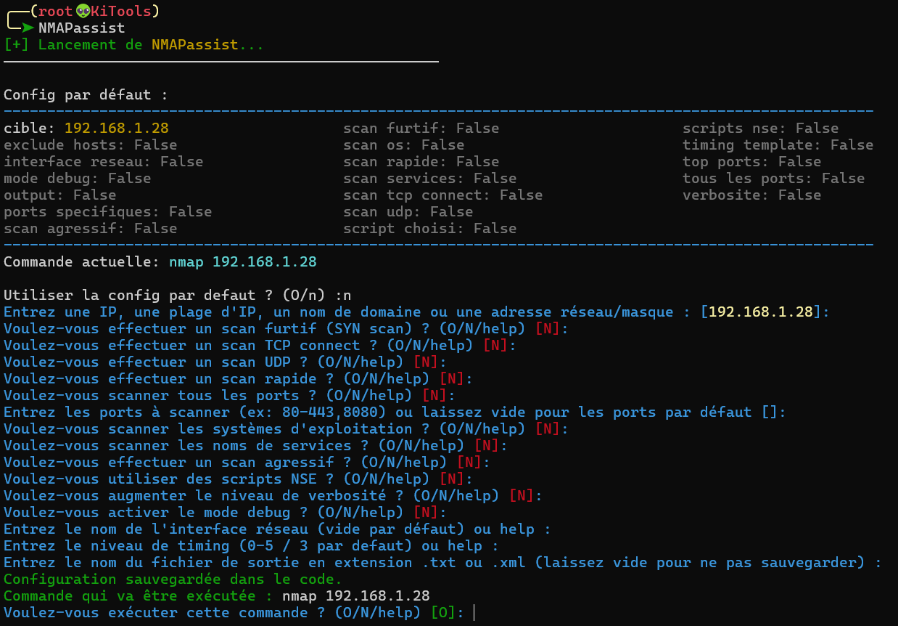
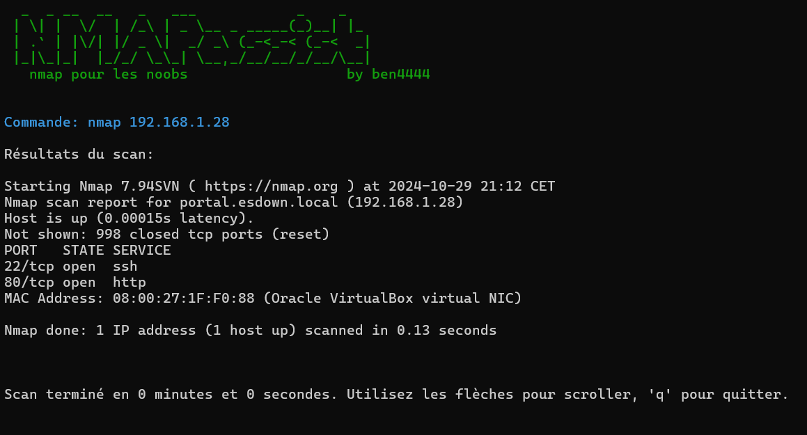
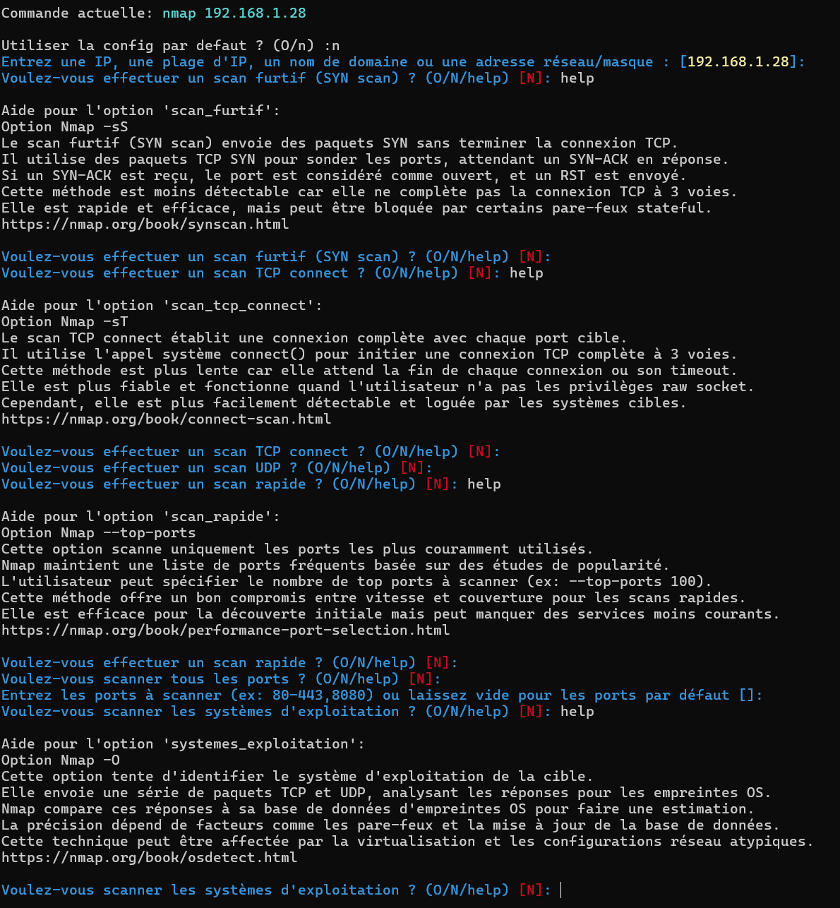
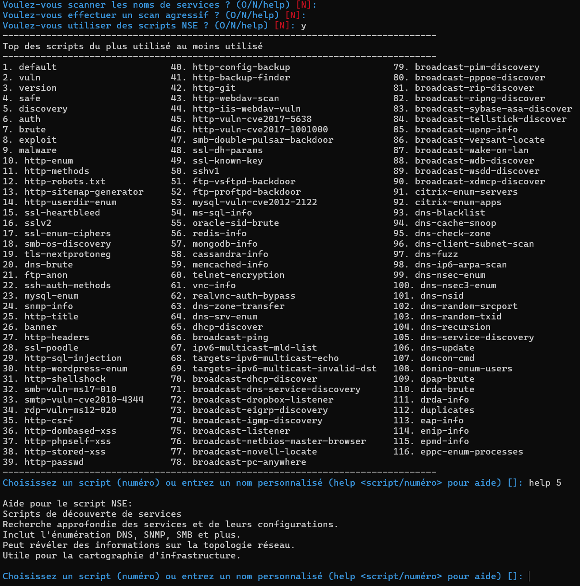
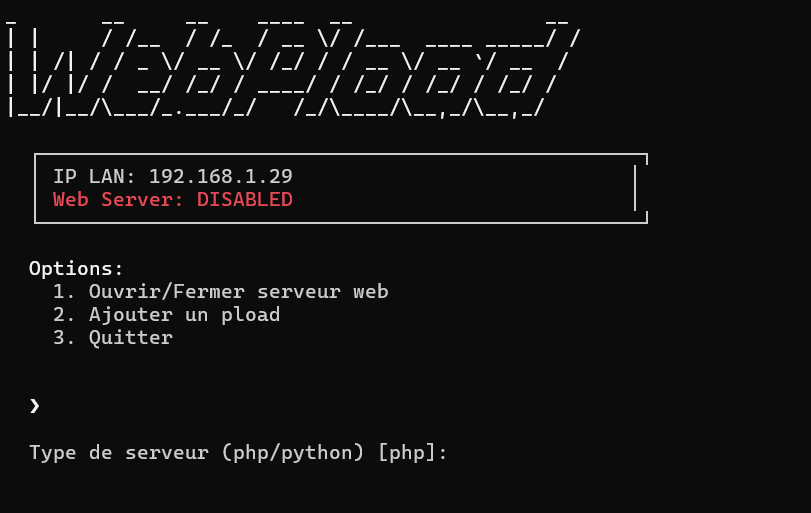
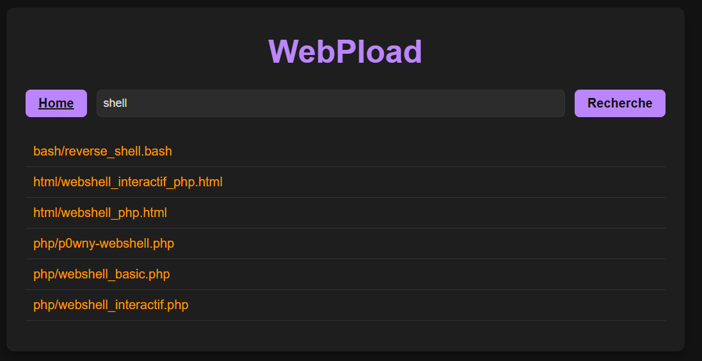
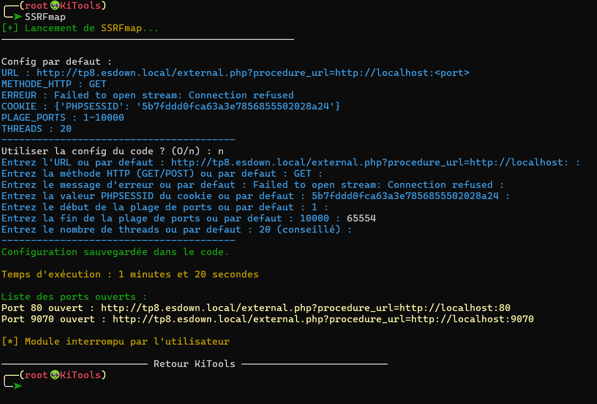
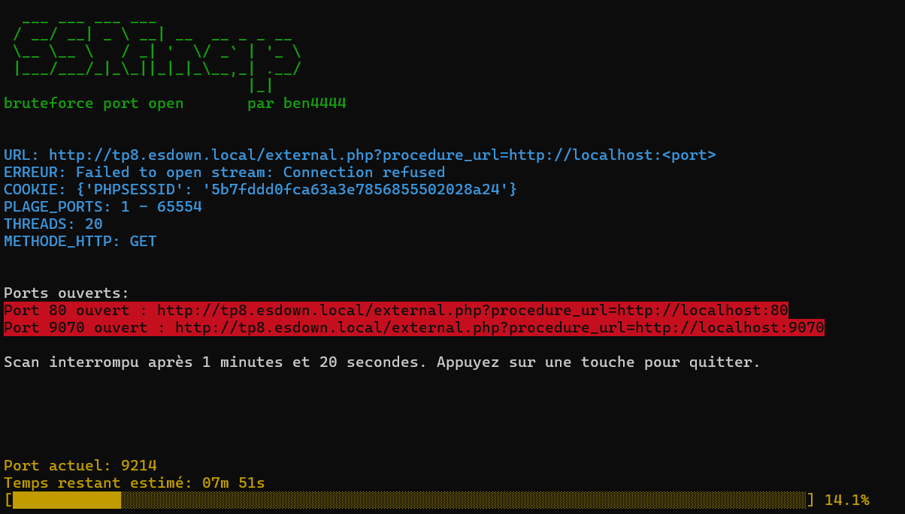

# KiTools

## Installation 
git clone https://github.com/Ben-4444/KiTools.git 
cd KiTools 
./install.sh

## Usage
┌──(root㉿kali)-[~] 
└─# KiTools

## Description
KiTools est un outil en ligne de commande qui regroupe plusieurs modules de pentest.
Il fait office de cheat sheet interactive pour certaintes applications comme nmap.
Ou permet l'automatisation de taches, comme l'ouverture d'un serveur web temporaire avec hébergement de payloads.
Et plus encore.

### Modules existants :

#### WebPload
Serveur web temporaire pour l'hébergement de payloads prêts à l'emploi :
- Création automatique d'un serveur PHP ou Python sur le port 80 (adaptable si 80 déjà utilisé)
- Génération de payloads prêts à l'emploi (webshells, reverse shells, XSS...)
- Option de génération de payloads msfvenom automatique
- Enregistrement de payloads personnalisés (persistant dans KiTools ou en cache)
- Gestion automatique des fichiers temporaires
- Nettoyage à la fermeture

#### NMAPassist 
Assistant pour Nmap offrant :
- Interface interactive pour configurer les scans
- Propose les principaux types de scan avec description de chaque option
- Gestion et description des scripts NSE
- Sauvegarde des configurations

#### SSRFmap
Module d'exploitation de vulnérabilité SSRF (Server-Side Request Forgery) permettant de :
- Détecter les ports ouverts sur un serveur cible via des requêtes HTTP
- Supporter les méthodes GET et POST avec gestion des cookies
- Effectuer des scans multi-thread avec barre de progression
- Sauvegarder la configuration
- gestion des erreurs (cookie/domain/redirect/etc...)

##Galerie :

<table>
  <tr>
    <th colspan="2">NMAPassist</th>
  </tr>
  <tr>
    <td></td>
    <td></td>
  </tr>
  <tr>
    <td></td>
    <td></td>
  </tr>
  <tr>
    <th colspan="2">WebPload</th>
  </tr>
  <tr>
    <td></td>
    <td></td>
  </tr>
  <tr>
    <td></td>
    <td></td>
  </tr>
    <tr>
    <th colspan="2">SSRFmap</th>
  </tr>
  <tr>
    <td></td>
    <td></td>
  </tr>
</table>

### Améliorations à venir :

### Modules à venir :

#### BruteForce Web
- Attaques par dictionnaire sur formulaires web
- Support de différents types d'authentification
- Gestion des sessions et cookies
- Détection automatique des champs

#### Auto Handler
- Auto Handler msf with option + pload msf in WebPload
- Auto Handler classique
- Handler Auto Push Script + Execute

#### Wifite
- lunch wifite with option

#### DDOS
- Scan port/services and select best target
- DDOS attack web
- DDOS attack ip/port

#### HYDRAssist
- like nmapassist but with hydra